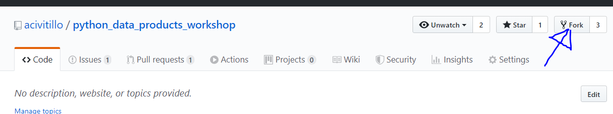
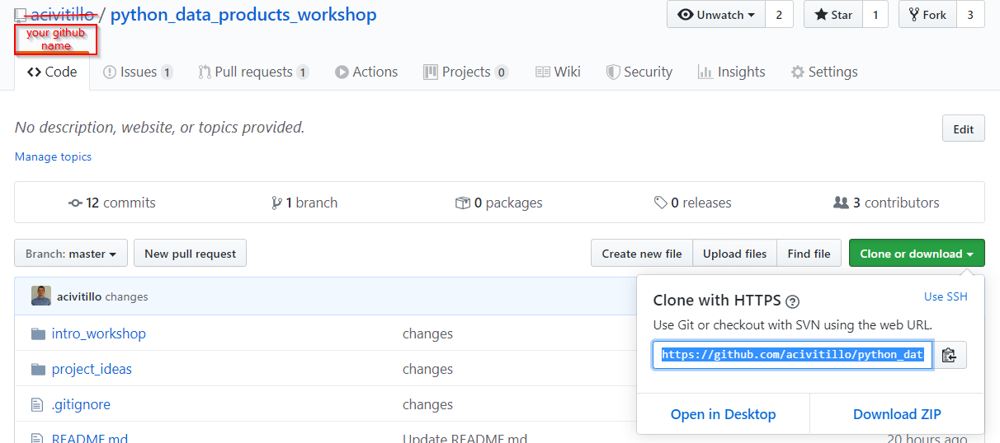
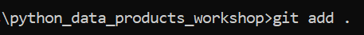
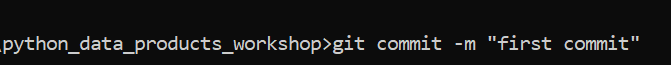
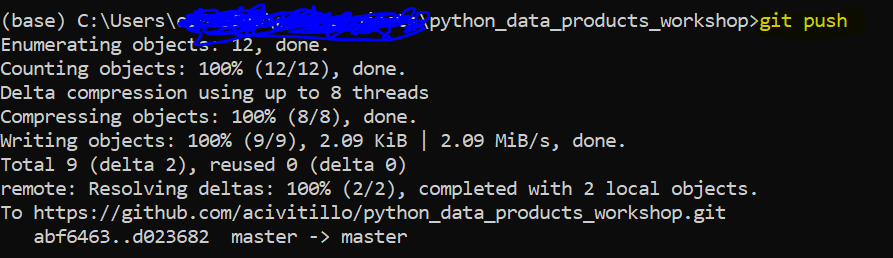
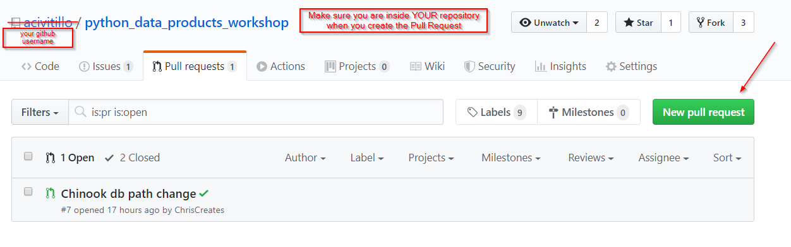
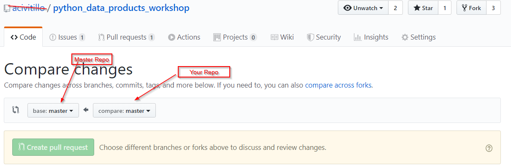

# Objectives

* Learn how to **collaborate**
* Understand importance of **issue trackers**
* Learn basics of git and github

# Steps

**Note** git is very simple although it might look complicated now if you are a beginner. Git steps are always the same you:

* Copy (fork & clone) an existing repository (repository = folders)
* Change (add, commit) the data in your local copy
* Push the changes to your remote copy
* Send (pull request) the changes over the original master repository

### 1) Install git to your PC and create a user account on github.com
* Install git on your PC. Windows: https://git-scm.com/download/win
* Create a user account on github: https://github.com/
* Create a task  named "do git setup exercise" here https://github.com/acivitillo/python_data_products_workshop/issues. You can do it by openning issue: Click link mentioned above --> New Issue --> Give it a title ;)

### 2) Fork & Clone
* On github.com click `Fork`. This will replicate the master repository into your account
    
* Go back to your respository on github.com and copy the git link
    
* Go to your PC and start your terminal (`cmd` on Windows)
* Clone your repository to your local pc by typing `git clone [your git link here]` in your terminal

What has happened? You created a copy of the master repository into your github account. You now have a full copy of the code, docs and files into 2 places 1) your github.com account; 2) your local pc.

### 3) Change, Commit
* Add your sentence to submissions.txt (you can use the standard notebook application on your pc)
* do `git add .` 
    
* then `git commit -m "first commit"` 
    

### 4) Push
* Push from your local PC to your remote repository in github.com `git push`
    

### 5) Create a Pull Request (send your changes to the master repo)
* On github.com go to `pull requests` and click `new pull request`
    
* Then click `create pull request`. **Note** make sure the repo on the right is yours and then one on the left is the master repo
    
### 6) Finally
* Close your task on the issue tracker

# Moving forward

* **Remember** from now you will create an issue in the tracker for each task you do. If you have problems performing a task ask me inside the issue directly
* Use the issue tracker of this repo to **ask me questions** now and after this intro_workshop
* Build your projects in github from the beginning
* Build up your curriculum on github by submitting your work there
